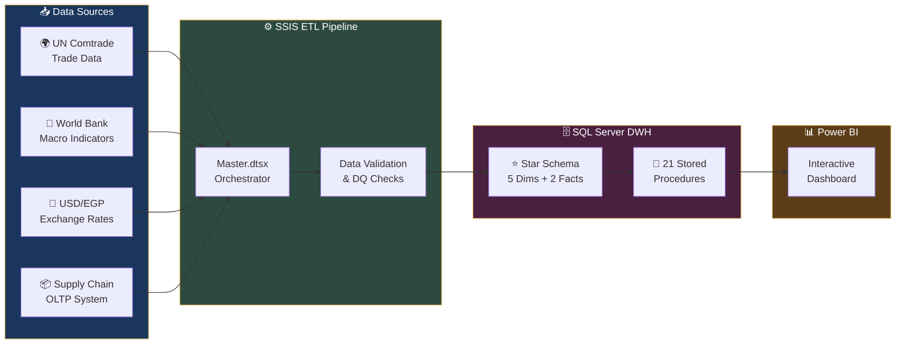
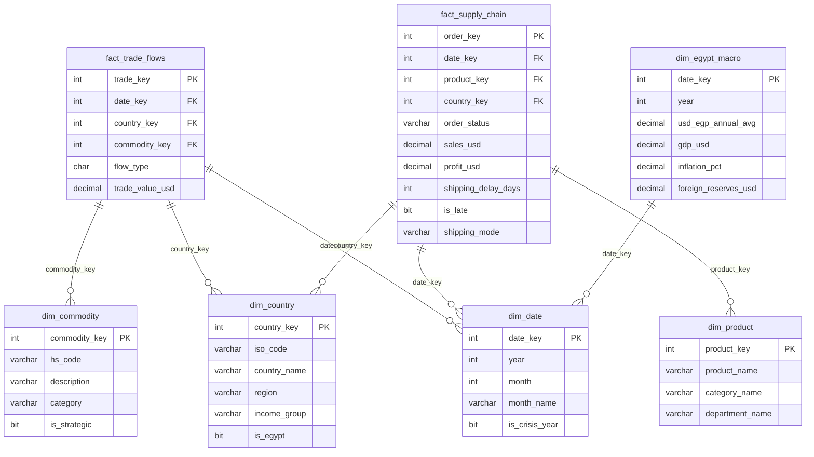
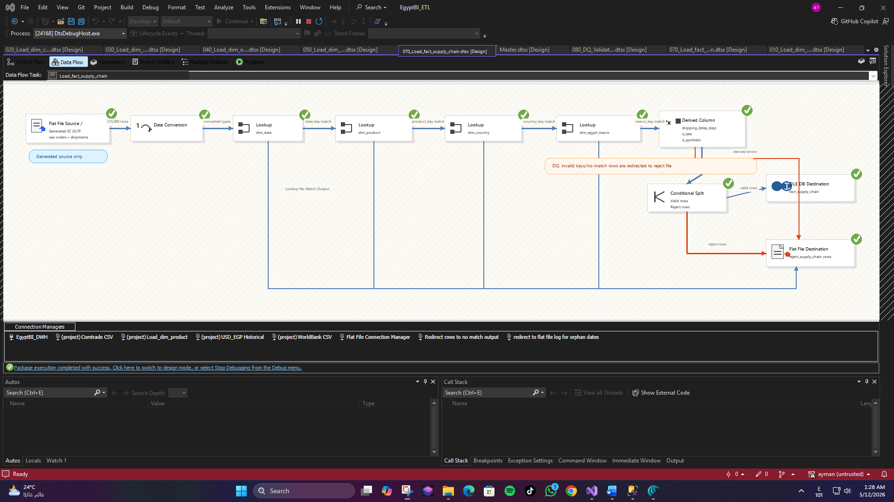
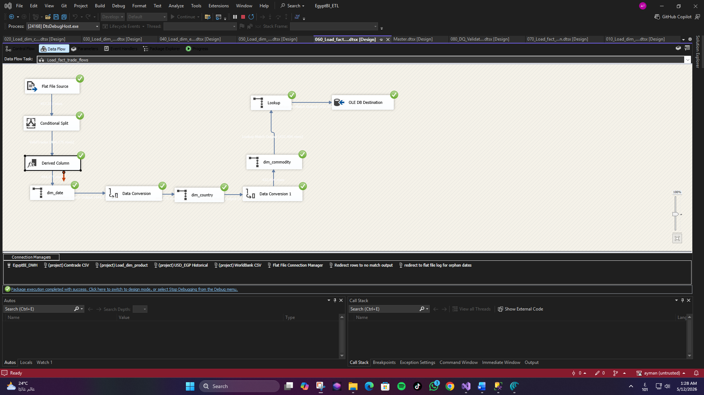
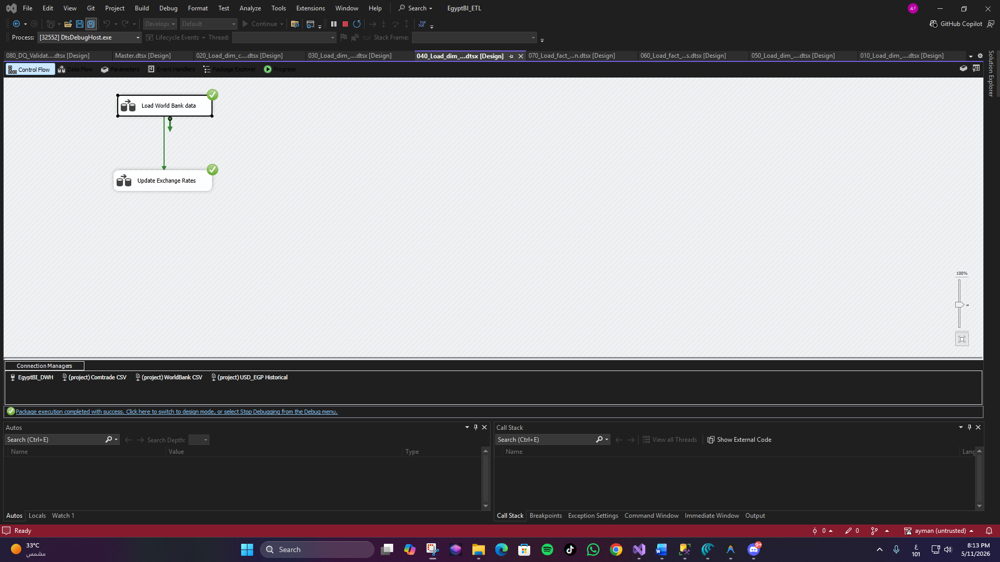

<p align="center">
  
</p>

<h1 align="center">🇪🇬 Egypt EconLens — Trade & Supply Chain BI Platform</h1>

<p align="center">
  <strong>A comprehensive Business Intelligence platform analyzing Egypt's trade dynamics, supply chain performance, and macroeconomic indicators (2019–2025)</strong>
</p>

<p align="center">
  <a href="#-overview"></a>
  <a href="#-tech-stack"></a>
  <a href="#-etl-pipeline"></a>
  <a href="#-power-bi-dashboard"></a>
  
</p>

<p align="center">
  
  
  
  
</p>

---

## 📋 Overview

**Egypt EconLens** is an end-to-end BI platform built as an **ITI Graduation Project**. It transforms raw trade data, supply chain records, and macroeconomic indicators into actionable insights through an automated data pipeline and interactive dashboards.

### 🎯 Problem Statement

Egypt's trade ecosystem generates massive volumes of data across multiple agencies — **UN Comtrade**, the **World Bank**, and internal procurement systems. Decision-makers lack a unified view to:

- Track **trade balance trends** and identify deficit/surplus patterns
- Monitor **supply chain KPIs** (OTIF, late deliveries, fraud rates)
- Analyze the impact of **economic crises** (COVID-19, currency devaluations) on trade flows
- Identify **strategic commodities** and top trading partners
- Correlate **macroeconomic indicators** (GDP, inflation, USD/EGP rates) with trade performance

### ✅ Our Solution

A fully automated BI pipeline that:

1. **Ingests** data from 4+ heterogeneous sources
2. **Transforms & validates** using SSIS ETL packages with built-in DQ checks
3. **Stores** in an optimized Star Schema data warehouse
4. **Analyzes** through 21 stored procedures covering CRUD + analytics
5. **Visualizes** via an interactive Power BI dashboard with 10+ report pages

---

## 🏗️ Architecture



---

## 🛠️ Tech Stack

| Layer | Technology | Purpose |
|:---:|:---:|:---|
| 📊 | **Power BI** | Interactive dashboards & data visualization |
| 🗄️ | **SQL Server 2022** | Data Warehouse (Star Schema) |
| ⚙️ | **SSIS** | ETL pipeline & data orchestration |
| 📝 | **T-SQL** | Stored procedures, DQ validation |
| 🐍 | **Python** | Data preprocessing & synthetic data generation |
| 💱 | **REST APIs** | World Bank & exchange rate data ingestion |

---

## ⭐ Data Warehouse Schema

The DWH follows a **Star Schema** design optimized for analytical queries:



---

## ⚙️ ETL Pipeline (SSIS)

The ETL pipeline consists of **9 SSIS packages** orchestrated by a Master package:

| # | Package | Description |
|:---:|:---|:---|
| 🎯 | `Master.dtsx` | **Orchestrator** — executes all packages in dependency order |
| 1 | `010_Load_dim_date.dtsx` | Loads 84 monthly date records (2019–2025) |
| 2 | `020_Load_dim_country.dtsx` | Loads country dimension with ISO codes & regions |
| 3 | `030_Load_dim_commodity.dtsx` | Loads HS commodity codes with strategic flags |
| 4 | `040_Load_dim_egypt_macro.dtsx` | Loads World Bank macro indicators + exchange rates |
| 5 | `050_Load_dim_product.dtsx` | Loads product catalog from supply chain source |
| 6 | `060_Load_fact_trade_flows.dtsx` | Loads Comtrade trade data with FK lookups |
| 7 | `070_Load_fact_supply_chain.dtsx` | Loads supply chain orders with derived columns |
| 8 | `080_DQ_Validation.dtsx` | Runs data quality checks & logs results |

### ETL Screenshots

<details>
<summary>📸 Click to expand ETL pipeline screenshots</summary>

#### Fact Supply Chain — Data Flow
> Complex ETL with Flat File Source → Data Conversion → Lookups (date, product, country, macro) → Derived Columns (shipping_delay_days, is_late, is_synthetic) → Conditional Split → OLE DB Destination + Reject File

<p align="center">
  
</p>

#### Fact Trade Flows — Data Flow
> Flat File Source → Conditional Split → Lookups (date, country, commodity) → Data Conversions → OLE DB Destination

<p align="center">
  
</p>

#### Macro Indicators — Control Flow
> Load World Bank data → Update Exchange Rates (sequential execution with precedence constraints)

<p align="center">
  
</p>

</details>

---

## 📝 Stored Procedures (21 Total)

### 📖 READ Operations (10)

| Procedure | Description | Example Usage |
|:---|:---|:---|
| `sp_GetTradeSummary` | Trade summary by year/month | `EXEC sp_GetTradeSummary @year = 2023` |
| `sp_GetTradeBalance` | Exports vs. imports + deficit/surplus status | `EXEC sp_GetTradeBalance` |
| `sp_GetTopPartners` | Top N trading partners by value | `EXEC sp_GetTopPartners @flow='X', @top=10` |
| `sp_GetTopCommodities` | Top N traded commodities | `EXEC sp_GetTopCommodities @flow='M', @year=2022` |
| `sp_GetMacroIndicators` | Annual macro indicators (aggregated) | `EXEC sp_GetMacroIndicators @year = 2023` |
| `sp_GetMacroMonthly` | Monthly macro indicators (84 rows) | `EXEC sp_GetMacroMonthly @year = 2022` |
| `sp_GetSupplyChainKPIs` | OTIF, late %, cancellation %, fraud % | `EXEC sp_GetSupplyChainKPIs @year = 2024` |
| `sp_GetProductPerformance` | Product ranking by sales & margin | `EXEC sp_GetProductPerformance @top = 20` |
| `sp_GetShippingAnalysis` | Shipping mode comparison | `EXEC sp_GetShippingAnalysis @year = 2024` |
| `sp_GetCrisisImpact` | Crisis vs. normal period comparison | `EXEC sp_GetCrisisImpact` |

### ➕ CREATE Operations (3)

| Procedure | Description |
|:---|:---|
| `sp_AddCountry` | Add new country to dimension |
| `sp_AddCommodity` | Add new commodity with HS code |
| `sp_AddMacroData` | Add monthly macro indicator row |

### ✏️ UPDATE Operations (3)

| Procedure | Description |
|:---|:---|
| `sp_UpdCountry` | Update country details (region, GDP, population) |
| `sp_UpdMacroData` | Update macro indicators for a specific month |
| `sp_UpdCommodity` | Update commodity category or strategic flag |

### 🗑️ DELETE Operations (2)

| Procedure | Description |
|:---|:---|
| `sp_DelCountry` | Delete country (only if not referenced in facts) |
| `sp_DelCommodity` | Delete commodity (only if not referenced in facts) |

### 🔧 UTILITY Operations (3)

| Procedure | Description |
|:---|:---|
| `sp_DWH_HealthCheck` | Row counts for all tables vs. expected |
| `sp_SearchTrade` | Keyword search in trade data (for Text-to-SQL) |
| `sp_RunDQValidation` | Run DQ checks: row counts, value sums, FK integrity |

---

## 📊 Power BI Dashboard

The interactive Power BI dashboard features **10+ report pages** covering:

| Page | Key Visualizations |
|:---|:---|
| 🏠 **Executive Cockpit** | High-level KPIs, trade balance, GDP trends |
| 📈 **Trade Analytics** | Import/export trends, year-over-year growth |
| ⚖️ **Trade Balance** | Surplus/deficit analysis, balance by partner |
| 🌍 **Top Partners** | Geographic map, partner ranking by value |
| 🏷️ **Strategic Commodities** | HS code analysis, strategic item tracking |
| 📦 **Supply Chain KPIs** | OTIF %, late delivery %, cancellation rates |
| 🚚 **Shipping Analysis** | Mode comparison, delay distribution |
| ⚠️ **Risk & Fraud** | Suspected fraud detection, risk scoring |
| 🔄 **OTIF Performance** | On-Time In-Full delivery tracking |
| 📅 **Time Intelligence** | Date-based drill-down, crisis period overlays |
| 💱 **Exchange Rate Impact** | USD/EGP correlation with trade volumes |
| 🔴 **Crisis Analysis** | COVID-19 & devaluation impact assessment |

---

## 🤖 Egypt Trade AI Dashboard Web App

Egypt EconLens includes a Flask-based web application that integrates the Power BI dashboards with a smart **AI Chat Assistant** and **Power Automate workflow automation**.

### 🌟 Key Web App Features
- **Power BI Embedded Dashboard:** Seamless integration of interactive reports and paginated report canvases directly in the browser.
- **AI Text-to-SQL Chatbot:** Translates natural language questions about Egypt's trade and supply chain into SQL queries, executes them against the DWH, and displays real-time tabular and textual summaries.
- **Security & Integrity Middleware:** Checks generated SQL for safety (prevents destructive commands) and employs a self-repair mechanism to handle query syntax errors.
- **Power Automate Integration:** Allows users to subscribe to report update alerts and request instant PDF exports of dashboard views.

---

## 📂 Project Structure

```
📦 Egypt-EconLens/
├── 🐍 app2.py                           # Flask Web App entry point
├── 📄 requirements.txt                  # Python dependencies
├── 📄 .env.example                      # Configuration template
├── 📊 Full_Light_Mode_PowerBI.pbix      # Power BI dashboard
├── 📜 stored_procedures_FIXED.sql       # 21 DWH stored procedures
├── 📂 SSIS_Packages/                    # SSIS ETL packages
│   ├── Master.dtsx                      #   ├── Master orchestrator
│   ├── 010_Load_dim_date.dtsx         #   ├── Dimension loaders
│   ├── 020_Load_dim_country.dtsx      #   │
│   ├── 030_Load_dim_commodity.dtsx    #   │
│   ├── 040_Load_dim_egypt_macro.dtsx  #   │
│   ├── 050_Load_dim_product.dtsx      #   │
│   ├── 060_Load_fact_trade_flows.dtsx #   ├── Fact loaders
│   ├── 070_Load_fact_supply_chain.dtsx#   │
│   └── 080_DQ_Validation.dtsx        #   └── Data quality validation
├── 📂 middleware/                       # AI Assistant query and prompt logic
│   ├── prompt_builder.py                #   ├── Prompt construction
│   ├── schema_retriever.py              #   ├── DWH metadata lookup
│   └── sql_validator.py                 #   └── SQL validation and repair
├── 📂 templates/                        # HTML UI pages
│   └── index.html                       #   └── Main dashboard & chat interface
├── 📂 static/                           # UI Assets & Styling
│   └── css/                             #   
│       └── style.css                    #   └── Styling rules
├── 📂 knowledge/                        # LLM context references
│   ├── schema.json                      #   ├── JSON schema of DWH
│   └── schema.txt                       #   └── Text description of tables
├── 📂 data/                             # Sample data files
│   ├── dim_egypt_macro_READY.csv      #   ├── Macro indicators
│   └── USD_EGP Historical Data.csv    #   └── Exchange rates
├── 📂 screenshots/                      # ETL & architecture screenshots
└── 📄 .gitignore                        # Repository exclusion rules
```

> **📁 Full datasets** (CSV files > 100MB) are hosted on Google Drive:
> 🔗 **[Download Data Files](https://drive.google.com/drive/u/0/folders/15fnZJjcYtHDwM4jHUdfjSmm11OHchYoX)**

---

## 🚀 Getting Started

### Prerequisites

| Tool | Version | Purpose |
|:---|:---|:---|
| SQL Server | 2019+ | Data Warehouse hosting |
| SSMS | Latest | Database management |
| Visual Studio | 2019+ | SSIS package development |
| SSIS Extension | Latest | VS integration for SSIS |
| Power BI Desktop | Latest | Dashboard viewing |
| Python | 3.10+ | Flask Web App & AI Assistant backend |
| ODBC Driver 17 | Latest | SQL Server connection for Python |

### Setup Steps

```bash
# 1. Clone the repository
git clone https://github.com/3bslam/Egypt_EconLens.git

# 2. Download data files from Google Drive
# 🔗 https://drive.google.com/drive/u/0/folders/15fnZJjcYtHDwM4jHUdfjSmm11OHchYoX

# 3. Restore the database backup
# Open SSMS → Right-click Databases → Restore Database
# Select: EgyptBI_DWH1_Compressed.bak (from Google Drive)

# 4. Run stored procedures
# Open stored_procedures_FIXED.sql in SSMS → Execute

# 5. Configure SSIS
# Open SSIS packages in Visual Studio
# Update connection managers to point to your SQL Server instance

# 6. Open Power BI Dashboard
# Open Full_Light_Mode_PowerBI.pbix in Power BI Desktop
# Update data source connection if needed

# 7. Configure Flask Web App Environment
# Copy the example environment file and fill in your keys (OpenRouter API key, SQL Server name, etc.)
cp .env.example .env

# 8. Create Python Virtual Environment & Install Dependencies
python -m venv .venv
# On Windows (Powershell):
.\.venv\Scripts\Activate.ps1
# On Linux/macOS:
# source .venv/bin/activate

python -m pip install --upgrade pip
pip install -r requirements.txt

# 9. Run the Flask Web Application
python app2.py
```

---

## 📊 Key Data Sources

| Source | Description | Records | Period |
|:---|:---|:---:|:---:|
| 🌍 **UN Comtrade** | International trade flows (HS2 level) | ~250K+ | 2019–2025 |
| 🏦 **World Bank** | GDP, inflation, foreign reserves | 84 rows | 2019–2025 |
| 💱 **Investing.com** | USD/EGP monthly exchange rates | 84 rows | 2019–2025 |
| 📦 **Supply Chain (Synthetic)** | Orders, shipping, procurement data | ~315K | 2019–2025 |

---

## 🔍 Key Insights Discovered

<table>
<tr>
<td width="50%">

### 📉 Trade Balance
- Egypt maintains a **persistent trade deficit**
- Deficit widens significantly during **crisis years**
- Top import categories: mineral fuels, machinery, cereals

</td>
<td width="50%">

### 💱 Currency Impact
- **EGP depreciation** (15.66 → 50.83 EGP/USD) correlates with:
  - Rising import costs
  - Inflation spikes (5% → 34%)
  - Reserve drawdowns

</td>
</tr>
<tr>
<td width="50%">

### 📦 Supply Chain
- Average **OTIF rate**: tracked across shipping modes
- **Fraud detection**: SUSPECTED_FRAUD orders isolated
- **Late delivery %**: varies by shipping mode and season

</td>
<td width="50%">

### 🔴 Crisis Analysis
- **2022 devaluation**: trade value shifted dramatically
- **COVID-19**: supply chain disruptions quantified
- **2023 inflation peak**: 33.88% — highest in study period

</td>
</tr>
</table>

---

## 👥 Team Members

<table>
<tr>
<td align="center" width="20%">
<h4>Moaaz Ashraf</h4>
<a href="https://github.com/moaaz311"></a>
</td>
<td align="center" width="20%">
<h4>Shaimaa Hesham</h4>

</td>
<td align="center" width="20%">
<h4>Ayman Abdelsalam</h4>
<a href="https://github.com/3bslam"></a>
</td>
<td align="center" width="20%">
<h4>Eman Salah</h4>

</td>
<td align="center" width="20%">
<h4>Mahmoud Reda</h4>

</td>
</tr>
</table>

<p align="center">
  <strong>🎓 ITI — Information Technology Institute</strong><br/>
  <em>BI Track — Graduation Project 2026</em>
</p>

---

## 📖 Documentation

- 📄 **[Project Documentation](https://docs.google.com/document/d/1lHbXuJEGga4qOJOjWLg2ndSixNY3V0OE/edit?usp=sharing&ouid=115243931777492490675&rtpof=true&sd=true)** — Full project pitch, methodology, and analysis
- 📁 **[Data Files (Google Drive)](https://drive.google.com/drive/u/0/folders/15fnZJjcYtHDwM4jHUdfjSmm11OHchYoX)** — Raw datasets and database backup

---

## 📜 License

This project is licensed under the **MIT License** — see the [LICENSE](LICENSE) file for details.

---

<p align="center">
  
</p>
